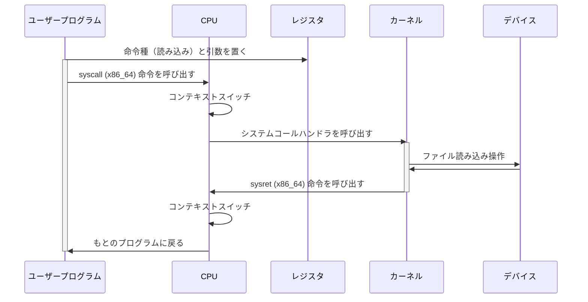

import { Card, CardGrid } from '@astrojs/starlight/components';
import { Aside } from '@astrojs/starlight/components';
import Figure from '../../../../components/Figure.astro';

## Linux
### ユーザー空間とカーネル空間

LinuxのOSにおいて、プログラムの実行領域は主にユーザー空間（User Space）とカーネル空間（Kernel Space）2種類に分類される。

<Figure
    src={import("./assets/diagrams-system-stack.svg")}
    caption="Linuxシステムスタック構成図"
    class="bg-gray-50"
/>

通常、ユーザーが直接利用するプロセスや、サーバーで動作するサービスはユーザー空間で動作する。
ユーザー空間のプロセスは自プロセスのみ参照できるなど、権限に対する制限がかけられている。

一方、OSの心臓部であるカーネルはカーネル空間で動作する。カーネルからはCPUやメモリを直接操作したり、カーネルに読み込んだデバイスドライバを利用してハードウェアを操作したりすることができる。
ただし、カーネル空間のプログラムで例外が発生すると、システム全体の動作に影響をもたらす。

<table>
    <thead>
        <tr>
            <th>特徴</th>
            <th>ユーザー空間</th>
            <th>カーネル空間</th>
        </tr>
    </thead>
    <tbody>
        <tr>
            <td>CPU権限</td>
            <td>制限あり（ユーザーモード）</td>
            <td>特権あり（カーネルモード）</td>
        </tr>
        <tr>
            <td>ハードウェアアクセス</td>
            <td>システムコール経由</td>
            <td>直接アクセス・制御可能</td>
        </tr>
        <tr>
            <td>メモリアクセス</td>
            <td>自プロセスの領域のみ</td>
            <td>システム全体</td>
        </tr>
        <tr>
            <td>クラッシュ時の影響</td>
            <td>そのプロセスのみ強制終了</td>
            <td>システム全体が停止（カーネルパニック）</td>
        </tr>
        <tr>
            <td>主な動作プログラム</td>
            <td>通常のアプリケーション（ブラウザ、DB等）</td>
            <td>CPU管理、メモリ管理、デバイスドライバ</td>
        </tr>
    </tbody>
</table>

### システムコール
ユーザー空間のプロセスがハードウェアに関する操作等、そのままでは許可されない操作を行いたい場合に利用するのがシステムコールである。例えばユーザー空間のプロセスがファイルの読み込みを行いたい場合に、カーネル側にファイル読み込みを依頼する（システムコールを出す）。システムコールはCPUに専用の命令が用意されている。これが呼び出されるとCPUはカーネルモードへの切り替え（コンテキストスイッチ）を行ったうえで、カーネル内のシステムコールを処理するプログラムを実行する。

### OSとカーネル
「Ubuntu」や「Windows」というときのOSは、カーネルに加え、ユーザー空間で動作するプログラム群を加えたものを指す。カーネル以外には以下のようなものが含まれる。

- **システムライブラリ（glibcなど）**  
  システムコールをラップしたライブラリ（`printf`, `malloc` のようなもの）
- **シェル、基本コマンド**  
  シェルの画面（`sh`, `bash` 等）や、`ls`, `cp`, `mkdir` などの基本コマンド
- **システムデーモン**  
  ネットワーク設定、日付の同期、システムの起動管理（`systemd` など）を行うバックグラウンドプログラム

## 仮想マシン（VM）とコンテナ

<Figure
    src={import("./assets/diagrams-system-stack-comparison.svg")}
    caption="システムスタックの比較"
    class="bg-gray-50"
/>

### ホスト型VM
物理マシンのOS（ホストOS）上に「VirtualBox」「VMWare Workstation」などの仮想化ソフトウェアをインストールして動かす。

- ✅ 導入が容易
- ✅ ホストOSとゲストOSが異なっていても動作する（Windows上でUbuntuを動かすなど）
- ❌ オーバーヘッドやリソースの無駄が非常に大きい
- ❌ ホストOSがクラッシュ時にゲストOSも終了してしまう

### ハイパーバイザ型VM
エンタープライズ用途で主流な方式。「VMWare ESX」「Microsoft Hyper-V」「KVM」などのハイパーバイザを導入する。

- ✅ ハイパーバイザのオーバーヘッド、リソース消費は非常に小さいため、ハードウェアリソースを最大限有効利用できる
- ✅ VM同士が隔離されているため、1つのVMがクラッシュしても他のVMやシステム全体には影響しない
- ❌ 専用のハイパーバイザを物理サーバにインストールする必要がある
- ❌ 各VMがOSを丸ごともつ必要があり、メモリやディスク消費が大きく、柔軟性が低い

### コンテナ
ホストOSの機能を用いてユーザー空間のみを隔離する。「Docker」「Podman」「Kubernates」が代表的。

- ✅ ゲストOSがないため、起動が高速で、オーバーヘッドが小さく、リソース消費も最低限
- ✅ どの環境にも同じアプリケーションを用意に複製して実行できる
- ❌ ホストOSと異なるOSを動作させることはできない（Windows上でUbuntuは不可）
- ❌ ホストOSの脆弱性やバグがコンテナに影響する可能性がある
